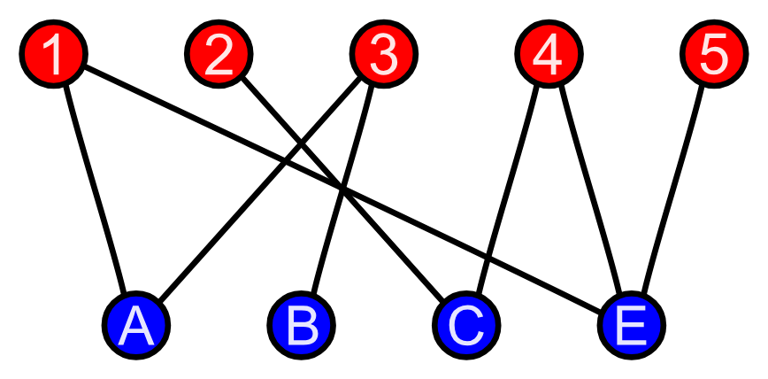

# Graph Traversal

Two typical and common graph traversal algorithms are DFS and BFS.

## DFS (Depth-First Search)

DFS has the idea to reach all the way down on the depth of a graph before moving on to the next one.

DFS is usually written recursively (which DOES means to be careful of StackOverflow), with an adjacency list and a boolean visited arrays.&#x20;

Notes: If the graph is a tree, then the visited array is not necessary. The dfs function header can take in an extra parameter on the parent node, to make sure the next search does not go back up the tree.

## BFS (Breadth-First Search)

BFS, on the other hand, traverses all nodes on each degree (or row, level, depth, whatever you wanna call it), before moving one depth further.

A queue is typically used for BFS and an iterative approach is usually taken.

<figure><figcaption><p>From GeeksForGeeks</p></figcaption></figure>

## Order Level Traversal

```
class Solution {
public:
    bool isEvenOddTree(TreeNode* root) {
        queue<TreeNode*> q;
        q.push(root);
        int depth = 0;
        while(q.size()){
            int size = q.size();
            int prev = (depth%2 == 0 ? 0 : INT_MAX);
            while(size--){
                auto node = q.front();
                q.pop();

                if(depth%2 == 0){
                    if(node->val %2 == 0 || node->val <= prev) return false;
                }else{
                    if(node->val%2 == 1 || node->val >= prev) return false;
                }
                prev = node->val;
                if(node->left) q.push(node->left);
                if(node->right) q.push(node->right);
            }
            depth++;
        }
        return true;
    }
};
```


## Problems

[https://leetcode.com/problems/even-odd-tree/description/](https://leetcode.com/problems/even-odd-tree/description/) (BFS level order traversal)
