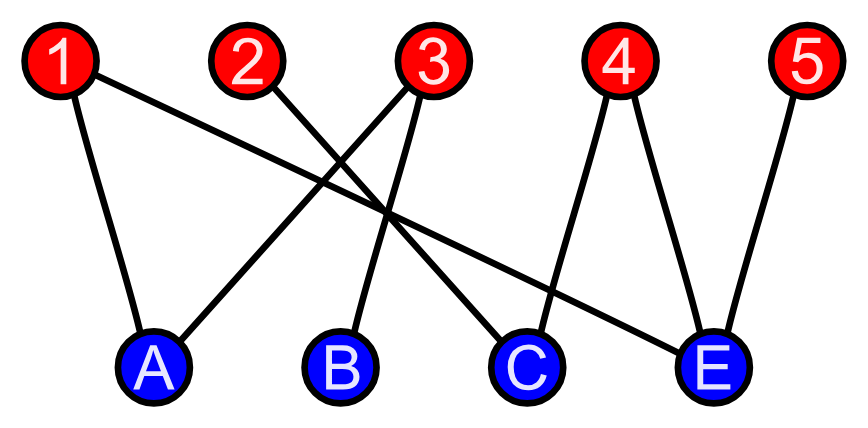

# Bipartite

A graph is bipartite if its nodes can be colored using two colors so that there are no adjacent nodes with the same color.

Or, in more formal words:

**A bipartite graph is a graph where the vertices can be divided into two disjoint sets such that all edges connect a vertex in one set to a vertex in another set**

<figure><figcaption></figcaption></figure>

## Check Bipartiteness

It is fairly simple to check if a component of a graph is bipartite. All we do is we start with any node by assigning it a color (any color, because if it is bipartite the initial color does not matter and can be switched to the other one just fine). Then traverse the graph using DFS along the way while checking if all neighbors are of opposite colors. If not at any point, then abort the traversal and we can conclude the graph is not bipartite. It will have to be bipartite if we finishes the traversal.
